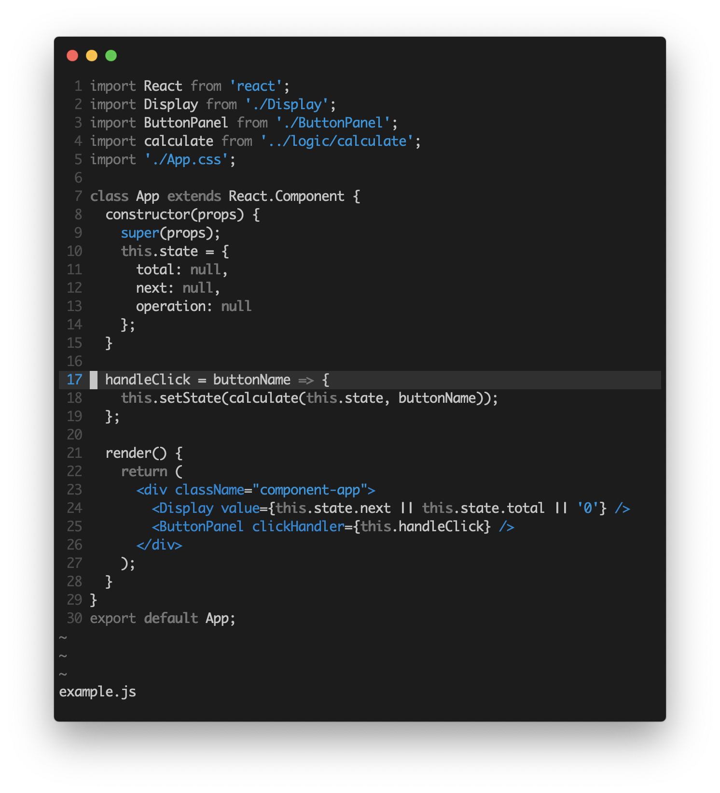

# fortress-vim

### A minimal colorscheme for vim.

## Screenshot




## Installation & Usage

```
Plugin 'javonharper/fortress-vim'
```

Then

```
set background=dark
colorscheme fortress
```

## Credits

Based heavily on the off, plain, and paramount colorschemes.
